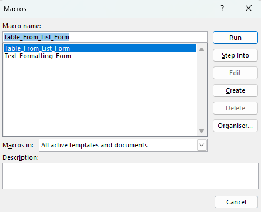
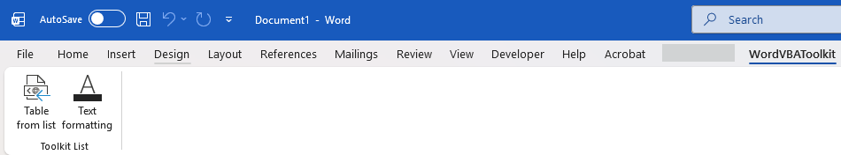
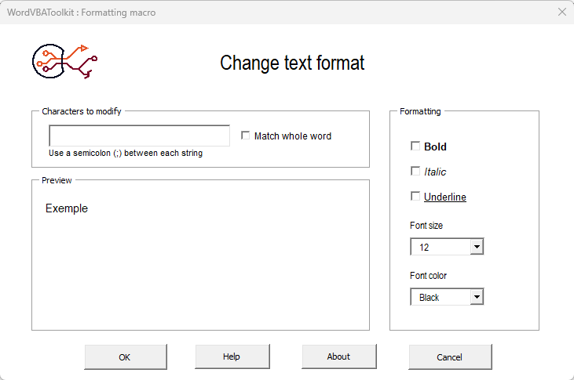
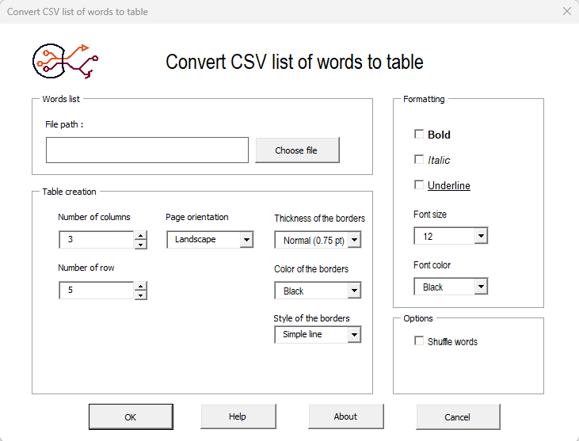

# WordVBAToolkit

[](https://github.com/BeeniGit/WordVBAToolkit/releases)
[](https://github.com/BeeniGit/WordVBAToolkit/releases/latest)
[](https://sonarcloud.io/dashboard?id=)


**WordVBAToolkit** is a collection of VBA (Visual Basic for Applications) tools designed to enhance and automate tasks in Microsoft Word. It provides reusable macros, utilities, and helper functions to streamline document processing, formatting, and repetitive workflows.

---

## Features

The toolkit currently includes two distinct tools accessible via dedicated user interfaces:

### 1. Text Formatter
A utility designed to apply specific formatting styles to a user-defined string in an entire document.
- **Input:** Accepts a text string entered directly by the user.
- **Capabilities:** Applies various formatting options such as **Bold**, *Italic*, Underline, and other standard Word text styles.
- **Use Case:** Ideal for quickly generating formatted text snippets to insert into documents without manual styling.

### 2. CSV Table Importer & Formatter
A comprehensive tool for importing data from external CSV files and integrating it into Word tables with automated formatting.
- **CSV Import:** Opens and parses local CSV files.
- **Dynamic Table Creation:** Generates a Word table based on the CSV content, respecting dimensions defined by the user.
- **Bulk Formatting:** Applies the same formatting logic as the *Text Formatter* tool (**Bold**, *Italic*, etc.) but operates on the entire imported text content within the table cells, rather than a single string.
- **Use Case:** Perfect for converting raw data exports into professionally formatted tables ready for reporting or documentation.

---

## Installation

1. Close Microsoft Word
2. [Download the latest release](https://github.com/BeeniGit/WordVBAToolkit/releases/latest)
3. Copy and paste the download file "WordVBAToolkit_template.dotm" in the following path :
   ```bash
   C:\Users\{Your_User_Name}\AppData\Roaming\Microsoft\Word\STARTUP
⚠️ Don't forget to change the ```{Your_User_Name}``` by your session name

5. Open Microsoft Word and enjoy 

---

## Usage
Two uses are possible : 
1. Open the Macros section Microsoft Word (the ```Developper``` option must be enable) or press ```Alt + F8```.

2. In the Microsoft Word ribbon, click on the tab named "WordVBAToolkit" and choose the desired tool.


### Using the Text Formatter
1. Launch the macro named "Text_Formmating_Form".
2. Enter your desired text in the input field.
3. Select the formatting options (e.g., Bold, Italic).
4. Click "OK" to search the user string in all document and change the format.



### Using the CSV Importer
1. Launch the macro named "CSV_To_Table_Form".
2. Click Browse to select a .csv file from your computer.
3. Define the table dimensions or let the tool auto-detect based on the file structure.
4. Select the global formatting style to apply to the table content.
5. Click "OK" to generate the table in your document. (The document must be empty before that)



---

## Requirements
- Microsoft Word 2016 or earlier (Desktop version)
- Macros must be enabled in your Word Trust Center settings.

---

## License
This project is open source and available under the [MIT License](https://github.com/BeeniGit/WordVBAToolkit/blob/main/LICENSE).

---

## Contributing
Contributions are welcome! Feel free to open an issue or submit a pull request to add new formatting options or support for other file types.

---

## Author
- **GitHub:** [BeeniGit](https://github.com/BeeniGit)
